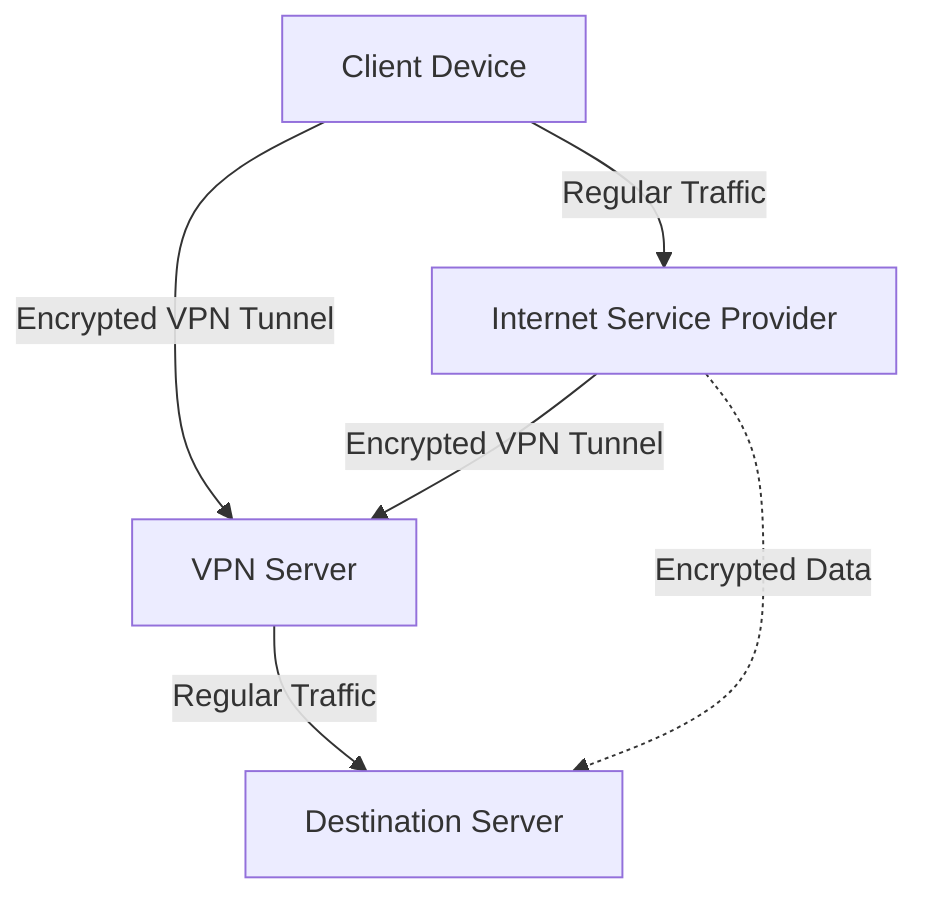

# Chapter 4

Continue imagining that you're playing Minecraft, like in Chapter 2. Now that you know the game, you have the locations written down, and you have some wood and a crafting table at your disposal, you can build tools like wooden axes, shovels, swords, a bed, and a shelter to sleep at night. You can kill mobs, pick rocks, and mine stones.

As you get more and more advanced, you'll move on to stone tools, then iron tools, and eventually diamond tools. If you've played the game, you know that reaching the diamond level requires deep adventures down scary caves and a lot of time and passion.

But this chapter is all about essentials—the wooden and stone tools of the privacy world. These are the bare minimums and basics that form the building blocks of your digital privacy and security. The essentials in the privacy world are different, though: they include encryption tools, anonymity tools, VPNs, emails, secure messengers, password managers, and multi-factor authentication tools. These things are the bare minimums for privacy and match most people's threat models.

## Passwords and Password Managers

Passwords are what protect our accounts, devices, and secrets. We need to take all actions to keep them safe, secure, and accessible only to ourselves. Trying to remember a hard password is a bad idea, and I've already explained why. If you use a single password for everything, no matter its complexity, if a data breach containing your account happens, then all your other accounts are accessible using that leaked password. And if you try remembering different passwords for every website, you will likely forget them all. Humans aren't that good at memorizing random passwords, especially if you don't recall them often.

Here, password managers come into play. Password managers are software, either online or offline, designed to store passwords and other notes and secrets safely and securely using encryption. The content inside them is accessible through one password, usually known as the master password. When using a password manager, you memorize a complex password as your master password, which is used to access other passwords inside your password manager's vault. Now you don't need to remember any other passwords or secrets.

A good password manager should have these characteristics:

1. **Encryption:** It needs to be encrypted. Never use a password manager if you're unsure of its encryption.
2. **Open Source:** They should be open-source. While open-source software isn't necessarily safer, being open-source allows us to check their code and the implementation of encryption to ensure they are safe.
3. **Independent Audits:** They must be audited independently. We aren't cryptography analysis experts, so an audit will reveal if there are any flaws in the cryptographic implementation of the software's encryption.
4. **Offline or Self-Hosted:** They should preferably be offline or self-hosted. There is no problem with a cloud-based password manager if it is implemented correctly. Even if their database gets leaked, the passwords should still be encrypted and secure. However, using a self-hosted or offline password manager, like Bitwarden (which can be self-hosted) or KeePass, minimizes the risk of leakage because it is far less likely that you will be targeted more than a password manager's server with thousands of users.

### Choosing a Secure Master Password

But how can you generate a secure master password? You need to forget the idea of passwords being random strings of letters, numbers, and punctuation characters. They become really hard for humans to memorize but not as hard for computers to crack through brute-force attacks. On the other hand, passphrases—lists of words separated by a character—are easy for humans to remember but much harder for computers to crack because they are usually longer and have more entropy than a typical password. They are easier to remember because they are words, and words have meanings to us, though not to computers. To computers, they still appear as random strings.

These passphrases are called Diceware Passphrases. An example of a Diceware passphrase is: **Batboy Wielder Defective Squire Facial Reptilian Monologue Avatar**

Avoid changing your master passwords too often unless you suspect that it has been compromised, to minimize the risk of forgetting it. Also, a good practice would be to have an encrypted backup of your passwords stored somewhere safe, ideally outside your devices and with a different password (in case you forget the main password), so you can restore your passwords and minimize the risk of losing access to your accounts.

## Email Security
Email services aren't secure by nature; new technology usually comes before security, and that's true for email as well as for the earliest protocols of the internet. But this lack of security can be overcome to some extent by adding layers of encryption to email services.

The first layer of encryption needs to be added to the communication channel. By "communication channel," I mean the channel that the data goes through to get to its destination, not the email content itself. This can be done by adding TLS to the transport layer of the email protocol. Nowadays, most email service providers have TLS enabled by default, but if you self-host your email service, you'll need to ensure transport layer encryption is enabled.

The second layer of encryption would be for the email content. This can be achieved using PGP or S/MIME encryption, but you will need to have your recipient's public key to send them encrypted emails. There are encrypted and privacy-focused email providers like ProtonMail and Tutanota that can eliminate this need for having the public key, provided that both sender and recipient use the same email provider. For example, two ProtonMail users can send each other encrypted emails without having to know each other's public keys.

Even if you encrypt the content of the email, the metadata would still be unencrypted. This metadata can include:

1. **Sender Email Address:** The email address of the person sending the email.
2. **Recipient Email Address(es):** The email address(es) of the recipient(s) of the email.
3. **Timestamps:** The date and time when the email was sent and sometimes when it was received.
4. **Subject Line:** The subject line of the email, which summarizes its content.
5. **Message-ID:** A unique identifier for the email message.
6. **Return-Path:** The email address to which bounced emails are returned.
7. **Received:** Information about the email servers and networks through which the email passed during transmission.
8. **X-Mailer:** An optional field indicating the email client or software used to compose the email.
9. **MIME-Version:** The version of the Multipurpose Internet Mail Extensions (MIME) protocol used in the email.
10. **Content-Type:** The type and format of the message content, such as text/plain for plain text or text/html for HTML-formatted content.

## Messaging Security

Most chat messages aren't secure either. For instance, Telegram, a messaging app that claims to be encrypted and secure, doesn’t even have end-to-end encryption (E2EE) enabled by default. Even when it does offer E2EE, it is only available on mobile clients, meaning you cannot use Telegram securely with the desktop client. Worse, Telegram breaks the first and most important rule of cryptography, which states, "Do not roll your own crypto," by using a self-rolled cryptographic scheme for its E2E encrypted chats. Additionally, Telegram's servers are all closed source; nobody knows how the messages and data on Telegram are stored, whether they are encrypted, or who has access to these servers. Telegram is a perfect example of a poor messaging app in my opinion. While there are messaging apps that are worse than Telegram, they do not claim to be private and secure. Therefore, I will use Telegram as a bad example to explain what a messaging app should have.

- **End-to-End Encryption:** A secure messaging app should offer E2EE with a known and audited cryptographic scheme and implementation. Telegram provides E2EE to some extent, but its cryptography is questionable.
- **Anonymous Sign-Up:** A private messaging app should allow you to sign up anonymously, typically using an email. Telegram and Signal use phone numbers, which is reasonable for reducing spam, but there are ways around it, such as buying an anonymous VoIP number using Monero or cash.
- **Transparency:** A secure messaging app should be transparent about how they store data, what data they store, and under what circumstances the data can be handed over to authorities.
- **Metadata Collection:** Every message and account has some metadata that isn't usually encrypted. Telegram collects a lot of metadata about you, including your name, sign-up date, IP addresses, 2FA email, phone number, contacts, people you frequently talk to, and all your messages (if you do not use E2EE). They can hand this data over to authorities if required. In contrast, Signal collects little to no metadata about you and doesn’t have much to hand over even if a court order compels them to do so.
- **Popularity:** We can't make everyone use the same app. If everyone I know uses Telegram, I have to use Telegram too. This is a significant factor for a messaging app. I might use Matrix over Signal, despite Signal having better security and collecting less metadata than Matrix, because most people I talk with use Matrix, so I have to make some sacrifices.

Your threat model plays a huge role here. You might not care if your messages with friends are readable by Telegram or any other company. It depends on you and your threat model.

## Choosing a secure VPN
Normally, when you use the internet, your ISP can technically see all the data passing through the network. However, with most websites and services supporting TLS/SSL encryption today, your ISP cannot see much of the data, but they can still determine the IP address and domain name that you're requesting. Anything that your ISP can see, your VPN provider can see as well. Because of this, VPNs are mostly a shift in trust. For example, my ISP logs a lot of information that I prefer not to be logged and retains this data for a long period of time. However, the VPN provider I use (ProtonVPN and Mullvad) promises not to log anything. They are reputable, privacy-focused VPN providers that allow anonymous payments, especially Mullvad VPN. In this scenario, I prefer using the VPN all the time because I trust it more than my ISP. Sometimes, using a VPN is about bypassing censorship. VPNs are great for this as they encrypt the data passing through the network, making it difficult for censorship systems to detect. But even in this case, it is still a matter of shifting trust, and the VPN should collect little to no data about us and our activities.

For me, a VPN provider should have the following characteristics:

- **Strong Encryption:** It should use secure encryption methods and protocols, such as WireGuard and OpenVPN, and an encryption method that supports perfect forward secrecy. Perfect forward secrecy ensures that encrypted data cannot be accessed even if the actual key is compromised.
- **No-Logs Policy:** A private VPN provider should not keep logs of user activities, connections, timestamps, or IP addresses. For example, VPN providers like Mullvad, ProtonVPN, and Windscribe do not collect much about your traffic.
- **DNS Leak Protection:** A secure and private VPN should ensure that DNS queries are routed through the VPN tunnel, not through the user's ISP. This prevents the leaking of visited websites to the ISP.
- **Kill Switch:** A private VPN should provide a feature that disconnects the user from the internet if the VPN connection drops, ensuring that no data is transmitted over an unencrypted connection.
- **IP Address Masking:** The VPN should hide the user's real IP with one provided by the VPN servers.
- **Multi-Hop:** A useful feature for a VPN to have is multi-hopping, which routes user traffic through multiple servers in different locations, adding an extra layer of security and privacy.
- **Secure Authentication:** An ideal VPN provider would have multi-factor authentication systems (like TOTP or even SMS/email authentication codes) to protect user accounts.
- **Private Servers:** It should use private or dedicated servers rather than shared ones to reduce the risk of data interception.
- **Obfuscation:** It should provide obfuscation features to bypass censorship systems like Deep Packet Inspection (DPI), making the VPN traffic appear like regular traffic, usually using an obfuscation protocol like obfs4 or ScrambleSuit.
- **Jurisdiction:** It is better to be based in a country with strong privacy laws and outside the influence of surveillance alliances like the Five Eyes, Nine Eyes, or Fourteen Eyes.
- **Regular Audits:** It should have regular security audits by independent third parties to verify the no-logs policy and the overall security of the service.

These characteristics can vary based on the user's threat model. Not everyone cares about multi-hops and no-logs policies. You should always act based on your threat model.

## Operating Systems Security/Privacy

Operating systems are software that communicate with the hardware and manage hardware resources, such as memory allocation, task scheduling, I/O processes, and more. While these are core functionalities of an operating system (or its kernel), layers of software stack up on the kernel to create a usable operating system, which can greatly impact the privacy and security of its users.

The main operating systems I will discuss are iOS, Android, Linux, Windows, and macOS:

### Android

The **Android Open Source Project (AOSP)** is a decent and secure operating system, featuring verified boots, app sandboxing (a crucial security feature), and a robust permission management system.

However, when you buy an Android phone, the operating system on it is usually not vanilla Android. It is often modified with many additional apps and features primarily used for gathering data from user activities.

There are custom ROMs designed to address this issue. Even without custom ROMs, many unnecessary features can be disabled to minimize data collection.

More important than data collection is ensuring the phone is updated with the latest security patches if available, and avoiding rooting (as it can break app sandboxing and compromise the phone's security).

On some phones, like Google Pixels, you can install GrapheneOS, a very secure and privacy-respecting Android custom ROM.

### iOS

Unlike Android, iOS is not open source, so we cannot be sure how it operates internally, and there is not much you can do to change it if you have an iPhone. However, you can tweak the settings and disable unnecessary features to harden it for your needs.

### Windows

Microsoft Windows is one of the most common PC operating systems, but its security and privacy are not admirable. It sends a lot of telemetry data to Microsoft, it is closed source, making it harder to find and fix security bugs, so many zero-day vulnerabilities exist for Windows.

There might be settings to tweak and adjust, but the safer option would be to install a Linux distribution and use Windows in an isolated virtual machine if you absolutely need to have a Windows machine.

### Linux

Linux is a free and open-source operating system with excellent privacy features. Because it is open source and has been around for a long time, very few zero-day vulnerabilities exist for it.

Linux has thousands of distributions to choose from, making it suitable for any needs you might have. There are also many variations of the Linux kernel itself, such as linux-hardened, which is designed to have more security features enabled by default.

---

These were the bare minimums of privacy and security. As the book progresses, the chapters will become more technically advanced and more focused on anonymity. The next chapter will be all about encryption, as it is the building block of security in the online world.